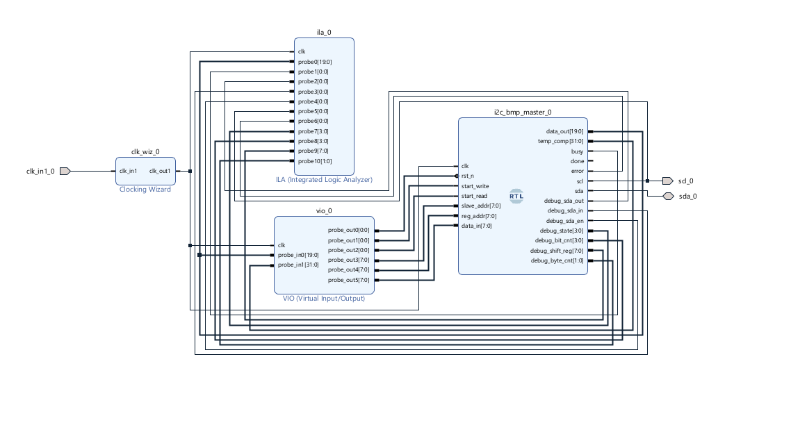

# I2C Master for BMP280 Sensor (Verilog)

## Overview
This project implements a **custom I2C Master controller in Verilog** to interface with the **BMP280 pressure and temperature sensor**.  
The design supports:

- **Single-byte register write**
- **3-byte burst read** for extracting **20-bit sensor data**
- Proper I2C sequencing with START, RESTART, ACK/NACK, and STOP
- FPGA-ready implementation with **IOBUF-based SDA control**
- **ILA-compatible debug signals** for real-time protocol inspection

The controller is optimized for BMP280 register access patterns and is suitable for FPGA-based sensor interfacing and embedded systems.

---

## Sensor Details
- Device: **BMP280**
- Interface: **I2C**
- Slave Address:  
  - `0x76` or `0x77` (configurable)
- Data Format:
  - Pressure / Temperature data stored as **20-bit values**
  - Read using **3-byte burst**: MSB, LSB, XLSB

---

## Features
- Fully synthesizable Verilog RTL
- I2C Master compliant with standard timing
- Supports:
  - Register address write
  - Burst read of 3 consecutive bytes
- Proper ACK after intermediate bytes
- NACK after final byte (per I2C spec)
- Error detection on NACK
- Busy / Done handshake signals
- Parameterized clock divider (~400 kHz I2C)
- **ILA debug visibility of internal FSM and data path**

---

## Block Diagram
The block diagram illustrates:
- I2C Master FSM
- Clock divider & phase generator
- SDA bidirectional control using IOBUF
- Interface to BMP280 sensor

---

## I2C Timing & Waveforms
The waveform below shows a complete BMP280 read sequence:
1. START condition  
2. Slave address + Write  
3. Register address write  
4. Repeated START  
5. Slave address + Read  
6. 3-byte burst read  
7. ACK for first two bytes  
8. NACK for final byte  
9. STOP condition  

---

## Top-Level Interface

### Clock & Reset
- `clk` : 100 MHz system clock
- `rst_n` : Active-low reset

---

### Control Signals
- `start_write` : Pulse to write a single byte to a BMP280 register
- `start_read`  : Pulse to initiate a 3-byte burst read
- `slave_addr`  : 7-bit BMP280 I2C address
- `reg_addr`    : BMP280 register address
- `data_in`     : Data byte to write
- `data_out`    : 20-bit sensor output data
- `busy`        : High during I2C transaction
- `done`        : Pulsed when transaction completes
- `error`       : Set if NACK is detected

---

### I2C Physical Interface
- `scl` : I2C clock output
- `sda` : Bidirectional I2C data line (via IOBUF)

---

## Internal Architecture

### Clock Generation
- System clock: **100 MHz**
- Target I2C frequency: **~400 kHz**
- Each I2C bit divided into **4 phases**
- Clock divider controlled by `CLKDIV` parameter

---

### FSM Design
The controller uses a **multi-stage FSM** with states including:
- IDLE
- START
- SEND ADDRESS (Write / Read)
- REGISTER ADDRESS WRITE
- DATA WRITE
- RESTART
- BURST READ
- ACK / NACK CONTROL
- STOP

This ensures correct timing and protocol compliance for BMP280 burst reads.

---

## Burst Read Handling (20-bit Data)
During a read operation:
- 3 bytes are read sequentially
- ACK is sent after byte 1 and 2
- NACK is sent after byte 3
- Data is assembled as:

